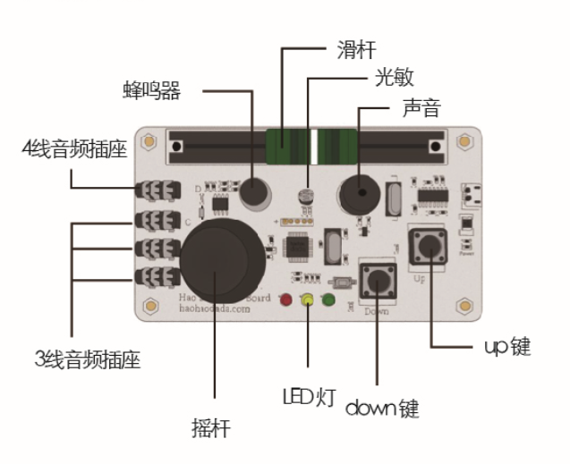

# Scratch传感器板说明   

## 概述
好搭Scratch传感器板是，是一款可以让Scratch动画和各种传感器交互的硬件，做出更加生动有趣的互动动画项目。好搭Scratch传感器板是一个让孩子从Scratch动画编程过渡到Scratch硬件编程的桥梁。

## 参数
* 32位ARM芯片
* 光线传感器
* 声音传感器
* 按钮
* 滑杆
* 摇杆
* LED灯x3
* 蜂鸣器
* 3路模拟输入扩展端口
* 一路通讯扩展端口
* 110x60x38mm
* 工作电压：DC5V

## 接口说明

## 使用方式

## 尺寸说明

## 常见问题

