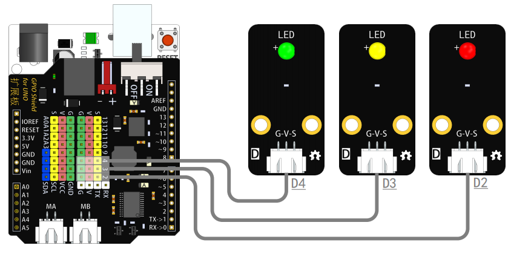

# LED灯模块说明   

## 概述
LED灯模块根据输入信号的不同来点亮/熄灭LED，也可亮度调节。

## 参数 
- 尺寸：48x24mm
- 工作电压：+3.3-5V
- 接口类型：XH2.54mm-3P
- 引脚定义：1-地 2-电源 3-控制端
- LED灯颜色：白、红、黄、绿

## 接口说明
- 可用端口：2、3、4、9、10、11、12、13、A0、A1、A2、A3

## 使用方式

## 原理图

## 尺寸说明

## 常见问题