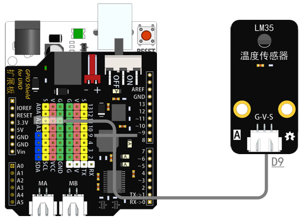

# LM35温度传感器模块说明   

## 概述
LM35温度传感器模块是基于LM35的半导体温度传感器，可以用来对环境温度进行检测。
温度测量常用的传感器包括热电偶、铂电阻、热敏电阻和半导体测温芯片，其中热电偶常用于高温测量，铂电阻用于中温测量（到摄氏800度左右），而热敏电阻和半导体温度传感器适合于100-200度以下的温度测量，其中半导体温度传感器的应用简单，有较好的线性度和较高的灵敏度。
LM35线性温度传感器与Arduino专用传感器扩展板结合使用，可以非常容易地实现与环境温度感知相关的互动效果。

## 参数 
- 尺寸：48x24mm
- 工作电压：+3.3-5V
- 灵敏度：10mV/℃
- 测量温度范围：0~100℃
- 接口类型：XH2.54mm-3P
- 引脚定义：1-地 2-电源 3-信号

## 接口说明
- 可用端口：A0、A1、A2、A3

## 使用方式

## 示例代码

## 原理图
[LM35温度传感器模块原理图](https://github.com/Haohaodada-official/haohaodada-docs/blob/master/%E5%8E%9F%E7%90%86%E5%9B%BE/LM35%E4%BC%A0%E6%84%9F%E5%99%A8%E6%A8%A1%E5%9D%97.pdf)

## 尺寸说明

## 常见问题