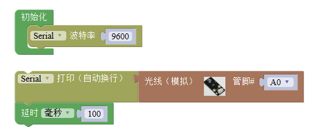
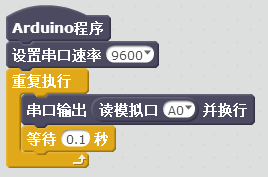

# 亮度传感器模块说明   

## 概述
亮度传感器模块通过光敏传感器,对环境光线的强度进行检测,通常运用于随光线强度变化产生特殊效果的作品。

## 参数 
- 尺寸：48x24mm
- 工作电压：+3.3-5V
- 接口类型：XH2.54mm-3P
- 引脚定义：1-地 2-电源 3-信号  

## 接口说明
- 可用端口：2、3、4、9、10、11、12、13、A0、A1、A2、A3  

## 使用方式

## 示例代码

[亮度传感器模块示例代码](http://www.haohaodada.com/show.php?id=956410)

## 原理图
[亮度传感器模块原理图](https://github.com/Haohaodada-official/haohaodada-docs/blob/master/%E5%8E%9F%E7%90%86%E5%9B%BE/%E5%85%89%E7%BA%BF%E4%BC%A0%E6%84%9F%E5%99%A8%E6%A8%A1%E5%9D%97.pdf)

## 相关资源

## 常见问题
 

