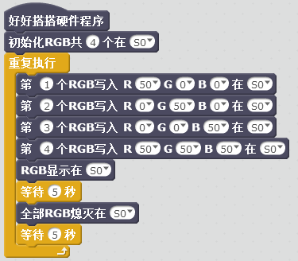

# 土壤湿度模块  

## 概述
土壤湿度模块通过简易的水分传感器可用于检测土壤水分，土壤水分含量越高，传感器输出值越大。模块的传感器表面做镀金处理，延迟其使用寿命，可直接插入土壤，使用便利。

## 参数 
- 尺寸：24x62mm
- 工作电压：+3.3-5V
- 接口类型：XH2.54mm-3P
- 引脚定义：1-地 2-电源 3-信号

## 接口说明
- 可用端口：2、3、4、9、10、11、12、13、A0、A1、A2、A3

## 使用方式

 