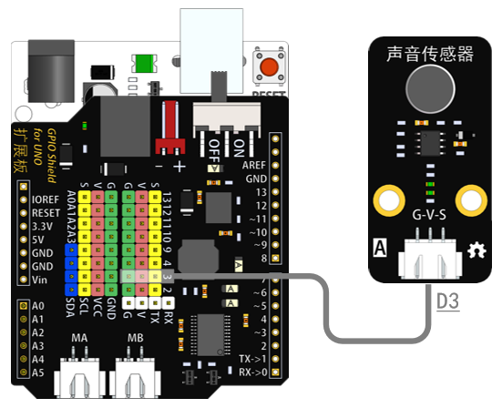

# 声音传感器模块说明   

## 概述
声音传感器模块采用咪头采集声音信号并转化成高低电平脉冲，脉冲经过再经过LM2904运算放大器放大输出，输出大于一定阈值就能点亮绿色LED，LED随着声音强度亮灭，声音越大，LED越亮。

## 参数 
- 尺寸：48x24mm
- 工作电压：5V
- 接口类型：XH2.54mm-3P
- 引脚定义：1-地 2-电源 3-控制端

## 接口说明
- 可用端口：2、3、4、9、10、11、12、13、A0、A1、A2、A3

## 使用方式

## 示例代码

## 原理图

## 尺寸说明

## 常见问题