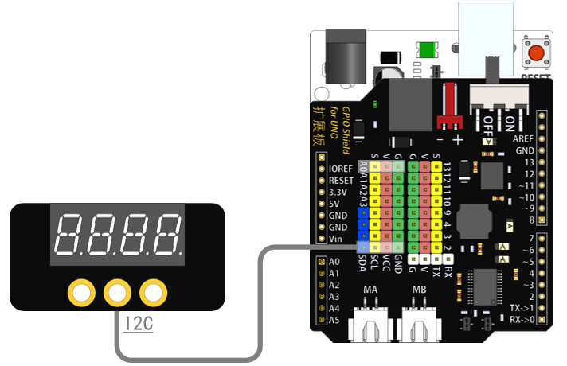

# 数码管模块说明   

## 概述
数码管模块可显示四位数字，操作简单。

## 参数 
- 尺寸：48x24mm
- 工作电压：5V
- 接口类型：XH2.54mm-4P
- 引脚定义：1-地 2-电源 3-SCL 4-SDA

## 接口说明
- 可用端口：四排排针

## 使用方式

## 示例代码

## 原理图
[数码管模块原理图](https://github.com/Haohaodada-official/haohaodada-docs/blob/master/%E5%8E%9F%E7%90%86%E5%9B%BE/4%E4%BD%8D%E6%95%B0%E7%A0%81%E7%AE%A1%E6%A8%A1%E5%9D%97.pdf)

## 尺寸说明

## 常见问题