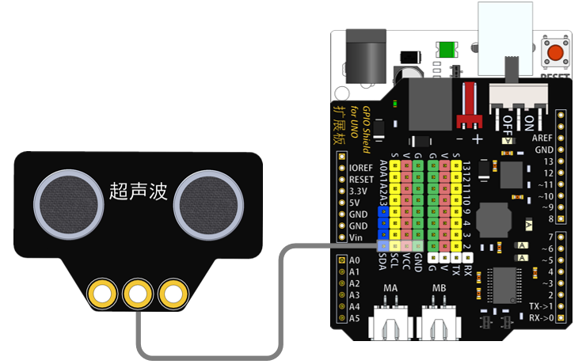

# 超声波传感器模块说明   

## 概述
超声波传感器模块有效探测距离范围为4-400cm，一个发射探头，一个接受探头。

## 参数 
- 尺寸：56x36mm
- 工作电压：5V
- 接口类型：XH2.54mm-4P
- 引脚定义：1-地 2-电源 3-SCL 4-SDA

## 接口说明
- 可用端口：四排排针

## 使用方式

## 示例代码

## 原理图
[超声波传感器模块原理图](https://github.com/Haohaodada-official/haohaodada-docs/blob/master/%E5%8E%9F%E7%90%86%E5%9B%BE/%E8%B6%85%E5%A3%B0%E6%B3%A2%E4%BC%A0%E6%84%9F%E5%99%A8%E6%A8%A1%E5%9D%97.pdf)

## 尺寸说明

## 常见问题