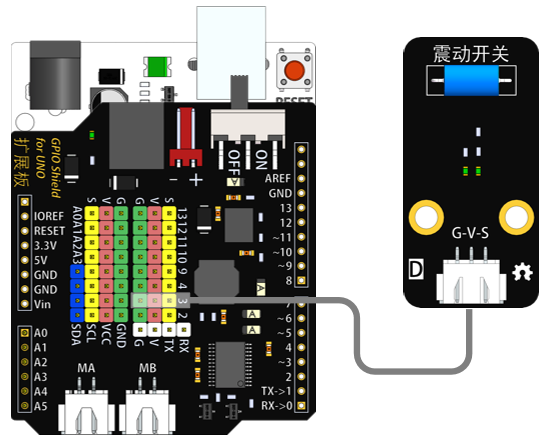

# 震动开关模块说明   

## 概述
震动开关模块是一种常闭开关。有震动时开关内部断开，输出低电平；没震动时开关内部闭合，输出高电平。

## 参数 
- 尺寸：48x24mm
- 工作电压：+3.3-5V
- 接口类型：XH2.54mm-3P
- 引脚定义：1-地 2-电源 3-控制端

## 接口说明
- 可用端口：2、3、4、9、10、11、12、13、A0、A1、A2、A3

## 使用方式

## 示例代码

## 原理图
[震动开关模块原理图](https://github.com/Haohaodada-official/haohaodada-docs/blob/master/%E5%8E%9F%E7%90%86%E5%9B%BE/%E9%9C%87%E5%8A%A8%E5%BC%80%E5%85%B3%E6%A8%A1%E5%9D%97.pdf)

## 尺寸说明

## 常见问题