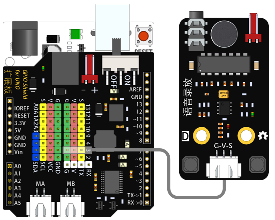
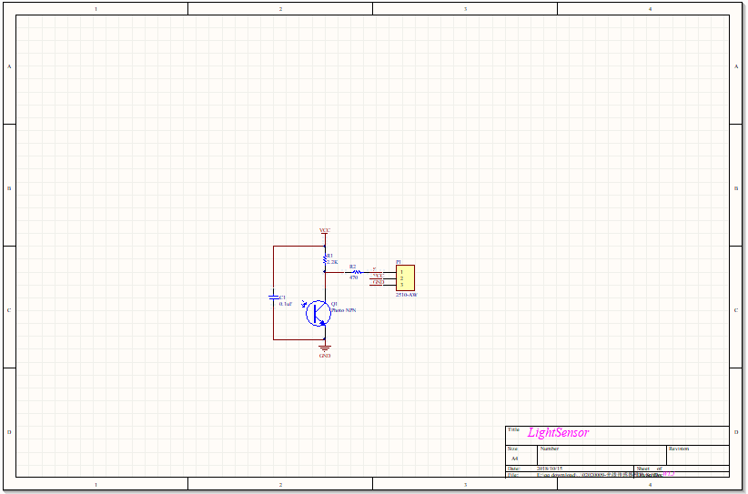

# 音频录放模块说明   

## 概述
音频录放模块集成录放音功能为一体。可通过按键实现音频的录制和播放。

## 参数 
- 尺寸：58x32mm
- 工作电压：5V
- 接口类型：XH2.54mm-3P
- 引脚定义：1-地 2-电源 3-控制端

## 接口说明
- 可用端口：2、3、4、9、10、11、12、13、A0、A1、A2、A3

## 使用方式

## 示例代码

## 原理图
[音频录放模块原理图](https://github.com/Haohaodada-official/haohaodada-docs/blob/master/%E5%8E%9F%E7%90%86%E5%9B%BE/%E9%9F%B3%E9%A2%91%E5%BD%95%E6%92%AD%E6%A8%A1%E5%9D%97.pdf)

## 尺寸说明

## 常见问题