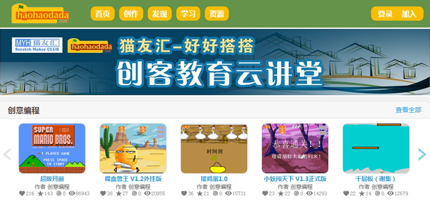
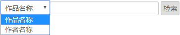
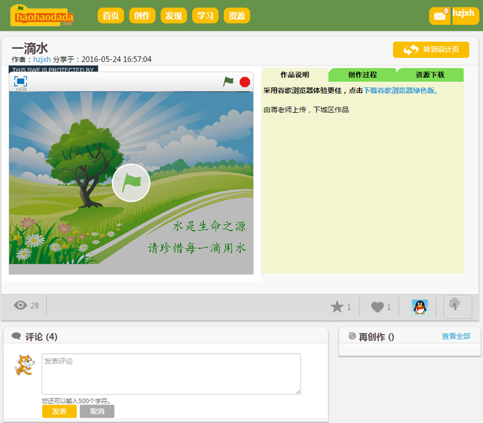

# 第1课  喵喵初体验

Scratch是美国麻省理工学院为少年儿童设计的图形化编程软件，利用Scratch可以创作出各种丰富多彩的计算机程序作品，体验到计算机程序创作的乐趣。

Scratch是美国麻省理工学院为少年儿童设计的图形化编程软件，利用Scratch可以创作出各种丰富多彩的计算机程序作品，体验到计算机程序创作的乐趣。

[单击此处](http://haohaodada.com/video/a20101.php)或者扫描下方二维码可以观看相关的视频。

*  

Scratch默认的角色是一只小猫，它的名字叫“喵喵”！它将陪伴我们一起学习Scratch编程。

### 在“好好搭搭”网站欣赏作品

“好好搭搭”是一个可以在线编写Scratch程序、在线学习Scratch程序设计、在线与网络上的Scratch爱好者交流编程经验的网站。

要进入“好好搭搭”网站，必须使用“网络浏览器”软件（最好使用“谷歌浏览器”），在浏览器软件的地址栏中输入“好好搭搭”网站的地址―—haohaodada.com，然后回车，就可以进入“好好搭搭”网站。

“好好搭搭”网站有大量的Scratch作品，它们是由全国各地的Scratch爱好者创建的。单击网站上方的“发现”按钮，在“发现”栏目网页中可以欣赏到这些丰富多彩的Scratch作品。

如果想查找特定的作品，可以拖动“发现”栏目网页右边的垂直滚动条到网页底部，通过指定“作品名称”或者“作者名称”来查找所需要的作品。

在“发现”栏目网页中，单击作品缩略图，可以进入这个作品的“项目页”。在作品项目页中，不仅能够运行这个作品程序，还能够了解作品的详细信息，评价、分享作品。

[单击此处](http://haohaodada.com/video/a20102.php)或者扫描下方二维码可以观看以上内容相关的视频。

*  