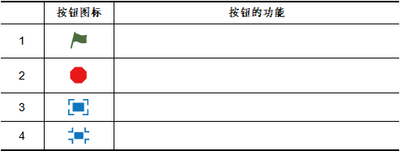

# 第2课  喵喵背古诗

唐朝诗人杜牧撰写的《山行》是一首描写和赞美深秋山林景色的七言绝句，诗中山路、人家、白云、红叶，构成一幅和谐统一的画面，小猫“喵喵”可喜欢这首诗了。

在本课的范例作品中，“喵喵”将和同学“咪咪”一起背诵《山行》这首诗，并依次按“喵喵”独背、“喵喵”和“咪咪”齐背、“喵喵”和“咪咪”对背三个步骤进行。

## 创意构思

在独背古诗环节，可以依次将四句诗分别放到单独的指令中，再将这些指令顺次连接起来；在齐背古诗环节，由于小猫“咪咪”与“喵喵”背诵的内容完全相同，因此可以使用“复制-粘贴”的方法来创建出“咪咪”的角色脚本；在对背古诗环节，可以通过“等待”指令协调“喵喵”与“咪咪”的背诵间隔时间，从而产生你背一句、我背一句的效果。

要完成本课的创意构思，需要了解以下的新指令：

1.  

属于“事件”类别指令；通过单击舞台右上方的  按钮执行这个指令下方的脚本。该指令在同一个Scratch程序中可以多次使用，让若干段脚本同时执行。

2.  

属于“外观”类别指令；在指定的时间内、在角色上方显示指定的文本内容。该指令共有两个参数，前一个参数用于指定显示的文本内容，后一个参数用于指定显示持续的时间。

3.  

属于“外观”类别指令；能够在角色上方一直显示参数所指定的文本内容。该指令只有一个参数，用于指定需要显示的文本内容。同一角色，后显示的文本内容会覆盖先前的内容。

4.  

属于“控制”类别指令；可以让角色等待指定的时间，用于延迟后续指令的执行。该指令只有一个参数，用于指定需要等待的时间，以“秒”为单位。

## 脚本设计

### 第一步：添加舞台背景

《山行》这首诗描写的是美丽秋天的景色，可以从Scratch舞台的“背景库”中挑选一张合适的背景图作为这个作品的舞台背景。 具体可以按以下步骤操作：

1. 单击舞台下方“背景列表区”的按钮，打开“背景库”对话框。
2. 在“背景库”对话框中单击“主题”中的“自然”类别，在对话框中找到“woods and bench”这个背景缩略图。
3. 双击所找到的缩略图，稍等片刻，就可以将它添加到舞台上。

[单击此处](http://haohaodada.com/video/a20201.php)或者扫描下方二维码可以观看以上内容相关的视频。

*  

#### 想一想

Scratch“背景库”中的背景在排列上有什么规律？怎样才能快速找到需要的背景图片？

[单击此处](http://haohaodada.com/video/a20202.php)或者扫描下方二维码可以观看相关的视频。

*  

### 第二步：添加角色

本课中除了小猫“喵喵”外还需要有另一个角色——小猫“咪咪”，由于“咪咪”跟“喵喵”完全相同，因此可以通过工具栏上的“复制”按钮添加：

首先，单击Scratch“程序设计页”上方“工具栏”中的按钮，鼠标指针就会变成形状；然后单击舞台上的小猫“喵喵”角色，“复制”出一只一模一样的小猫；接着分别用鼠标拖动舞台上的两只小猫，将它们摆放到合适的位置，最后根据前面所学过的知识，在“角色信息”区域将它们命名为“喵喵”和“咪咪”。

[单击此处](http://haohaodada.com/video/a20203.php)或者扫描下方二维码观看以上内容相关的视频。

*  

#### 试一试

1. 要添加小猫“咪咪”，也可以单击“角色列表区”中的  按钮，在“角色库”中添加。请你尝试用这种方法添加它。
2. 如果舞台上的角色多了，该如何处理？

### 第三步：编写程序，让“喵喵”背古诗

舞台背景和角色添加完成后，可以开始编写程序，首先编写让小猫“喵喵”能够逐句背诵《山行》这首古诗的程序： 

1. 由于编写的是小猫“喵喵”的程序脚本，因此需要单击选中“角色列表区”中的“喵喵”缩略图。
2. 如果没有显示“指令区”的话，可以单击“脚本”选项卡显示。

3. 将“指令区”中的  指令拖动到“脚本区”，并修改这个指令第一个参数为“远上寒山石径斜”，第二个参数可以不做修改，让小猫“喵喵”花2秒时间背诵第一句古诗。
4. 再从“指令区”拖动第二个  指令到“脚本区”，同时向第一个指令下方移动，当出现白色吸附线时，放开鼠标左键，这样两个指令就会组合在一起；组合完成后，修改这个指令第一个参数为“白云生处有人家”。
5. 继续拖动第三个、第四个  指令到“脚本区”，分别与前一个指令组合后再修改参数为《山行》的第三、四句诗句。

所有四个指令组合在一起后，单击第一条指令，就会执行这段程序脚本。

[单击此处](http://haohaodada.com/video/a20204.php)或者扫描上方的二维码可以观看以上内容相关的视频。

*  

### 第四步：让两只小猫齐背古诗

小猫“咪咪”背诵的古诗内容与“喵喵”一样，因此可以通过“复制-粘贴”的办法添加程序脚本，具体可以按以下步骤操作：

1. 确认当前选中的是小猫“喵喵”角色。
2. 用鼠标拖动“脚本区”中刚才所编写脚本的第一个指令，将这段脚本拖到“角色列表区”小猫“咪咪”的角色缩略图上，放开鼠标左键，就会为“咪咪”复制这段程序代码。
3. 单击“角色列表区”中的小猫“咪咪”角色缩略图，可以在它的“脚本区”看到复制的脚本。单击这段脚本的第一个指令，“咪咪”也会像“喵喵”一样背古诗。

4. 通过以上操作，这两只小猫都会背古诗了，但它们还不能一起背诵古诗。要让它们齐背古诗，需要将  指令分别拖动到这两个角色脚本的最上方，与之前编写的脚本组合在一起。这样，单击舞台右上角的  按钮，两只小猫才能齐背古诗。

[单击此处](http://haohaodada.com/video/a20205.php)或者扫描下方二维码可以观看以上内容相关的视频。

*  

#### 试一试

舞台上方有一些按钮，请你试一试它们有什么用？然后把你的发现记录下来：

 [单击此处](http://haohaodada.com/video/a20206.php)或者扫描下方二维码可以观看相关视频。

*  

### 第五步：让两只小猫对背古诗

除了齐背古诗，我们也可以让两只小猫对背古诗，也就是“喵喵”背上一句，“咪咪”背下一句，一人依次背一句。

由于在对背古诗中，小猫“喵喵”只需背诵第一、三两句，因此可以按照以下步骤操作，删除多余的指令：

1. 确认当前选中的角色是小猫“喵喵”。
2. 将  指令拖动到“指令区”，然后放开鼠标左键，可以删除这个指令；
3. 将  指令拖动到“脚本区”的空余位置，把它与原来的脚本分开；
4. 同样将  指令拖动到“指令区”删除；
5. 将刚才摆放在“脚本区”的  指令重新与第一句组合。

小猫“咪咪”需要背诵古诗的第二、四句，也可以像“喵喵”一样，将不需要的指令删除重新组合指令。

[单击此处](http://haohaodada.com/video/a20207.php)或者扫描下方二维码可以观看以上内容相关的视频。

*  

#### 试一试

除了将指令从“脚本区”拖动到“指令区”这种方法删除指令，还有什么办法也可以删除指令？你喜欢哪一种方法？

[单击此处](http://haohaodada.com/video/a20208.php)或者扫描下方二维码可以观看相关视频。

*  

以上操作完成后，单击"绿旗"运行程序，可以发现这两只小猫并没有你一句、我一句地对背古诗，而是一起背了。这就需要我们修改脚本，使一只小猫在背诵的时候，另一只小猫处于等待状态，具体操作方法如下：

1. 确认当前选中的角色是小猫“咪咪”，然后将“控制”类别中的  指令拖动插入到  指令上方，同时修改这个指令的参数为“2”。
2. 再将第二个  指令拖动插入到  指令上方，同样修改参数为“2”。
3. 小猫“咪咪”修改完成后，再单击选中“喵喵”，修改它的脚本。同样也是添加两个  指令，具体的方法与“咪咪”类似。

[单击此处](http://haohaodada.com/video/a20209.php)或者扫描下方二维码可以观看以上内容相关的视频。

-  

#### 想一想

如果两只小猫背诵每句古诗的时间不是统一的“2秒”，那么这些指令中的时间参数应该如何修改？

[单击此处](http://haohaodada.com/video/a20210.php)或者扫描下方二维码可以观看相关视频。

-  

### 第六步：改变小猫“咪咪”的方向

由于小猫“咪咪”与“喵喵”外观完全相同，因此它们在背诵古诗的时候没有面对面，这样不太礼貌。要让它们面对面，可以按以下步骤操作：

1. 确认已经选中“咪咪”。
2. 单击“角色列表区” “咪咪”角色缩略图左上角的  按钮查看角色信息。
3. 在“角色信息”的“方向”区域，默认显示的是“90º”，可以用鼠标向左拖动指针，改为“-90º”；再单击选中“旋转模式”中的  按钮，这样两只小猫就面对面了。

[单击此处](http://haohaodada.com/video/a20211.php)或者扫描下方二维码可以观看以上内容相关的视频。

*  

#### 试一试

除了可以通过“角色列表区”中的“角色信息”区域改变小猫的方向，试一试，还有其它办法也能够实现这一功能吗？

[单击此处](http://haohaodada.com/video/a20212.php)或者扫描下方二维码可以观看相关视频。

*  

### 第七步：在网站上保存作品

Scratch程序作品创作过程中，要注意随时保存程序。在“好好搭搭”网站上保存Scratch程序作品，可以按以下步骤操作：

1. 单击Scratch程序设计页“文件”菜单栏中的“重命名”选项，打开“更改文件名”对话框。
2. 在“更改文件名”对话框中输入合适的文件名，然后单击“确定”按钮。
3. 单击“文件”菜单栏中的“立即保存”选项，可以将这个Scratch程序作品保存到“好好搭搭”网站上。
4. 程序作品已经保存过一次以后，如果需要再次保存，可以直接单击“文件”菜单栏中的“立即保存”选项进行保存。

对于保存在“好好搭搭”网站上的程序作品，可以先单击网站右上角的登录用户名，然后在下拉列表中单击“我的作品”选项，就会打开的“我的作品”网页，在这个网页中可以看到所有保存在网站上的程序作品。

[单击此处](http://haohaodada.com/video/a20213.php)或者扫描下方二维码可以观看以上内容相关的视频。

*  

#### 练一练

将“喵喵背古诗”这个程序作品制作完成，然后保存到“好好搭搭”网站，同时将这个作品分享给自己的朋友，请他提些修改完善的意见。

## 拓展思考

小猫们成功地背诵了《山行》这首古诗，你还能展开想象，利用所学知识，让它们背诵古诗的过程更好玩吗？