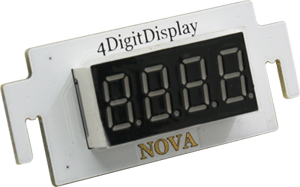
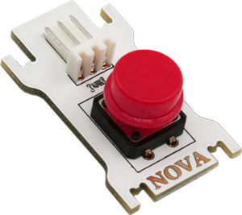
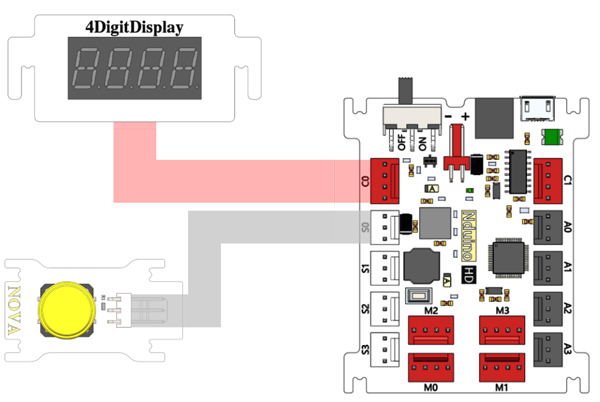
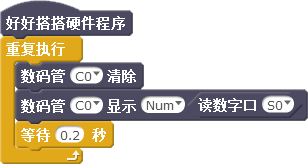
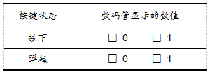

# 第三课 在Nova中使用数码管与按键——送给妈妈的定时器

[TOC]

数码管也叫做LED数码管，主要用来显示数字。由于它价格便宜、使用简单，在日常生活中应用非常普遍。本课我们将使用数码管和按键，为爱做烘焙的妈妈制作一个定时器，帮助她更加精确的掌握时间。


## 模块与指令

**要制作本课的范例作品，需要认识以下这些新的硬件：**

### 数码管模块

Nova入门套件中包含1个数码管模块，它最多可以显示由四个数字组成的数，所以叫做“四位数码管”（如下图所示）。数码管的每个数都是由八段LED组成，其中七段LED用于显示数字，第八段在数字的右下角，用于显示小数点。



### 数码管模块

Nova入门套件中包含2个单按键模块，可以作为开关使用（如下图所示）。按键有“按下”和“弹起”两种状态。默认状态是“弹起”；当用手指按住按键帽往下按、并且保持不动的时候，就处于“按下”状态；松开手指，按键又会重回处于“弹起”状态。




**要制作本课的范例作品，还需要使用以下新的指令：**

###“读数字口”指令：

使用这个指令可以读取指定数字口的输出值。指令默认是数字口“S0”。通过单击下拉列表，可以选择S0—S3这4个数字端口、A0—A3这4个模拟端口（这些模拟端口具备数字端口功能，可以当作数字端口使用）。


### “数码管显示”指令：

使用这个指令可以设置指定端口数码管显示指定的数值。指令默认是“C0”端口、“整数”类型、显示内容是“123”。通过单击下拉列表，可以选择C0-C1、M0-M3这6个端口；“Num”（整数）、“Float”（小数）这些数值类型；需要显示的数值可以在最后一个输入框中输入。


### “数码管清除”指令：

使用这个指令可以清除指定端口数码管上显示的内容。指令默认是“C0”端口。通过单击下拉列表，可以选择C0-C1、M0-M3这6个端口。


## 作品制作

要制作本课的范例作品，可以按以下步骤先连接硬件、运行插件程序，然后进入“好好搭搭”网站编写、调试、编译、下载程序。


### 第一步：搭建硬件、运行插件

首先将1根白色连接线一头插入按键模块的接口，另一头插入主控板的“S0”端口；再用1根红色连接线一头插入数码管模块的接口，另一头插入主控板的“C0”端口；（如下图所示）；接着用USB线把主控板和计算机连接起来，打开“好好搭搭硬件下载”插件，确认插件程序显示“打开端口成功”。




### 第二步：在数码管上显示指定数值

首先打开浏览器进入“好好搭搭”网站；然后单击进入网站的“创作”栏目，选择“haohaodada_NOVA模版”，进入“模版项目页”；在“模版项目页”中单击网页右上角的“转到设计页”按钮，进入“NOVA编程设计页”。

在“NOVA编程设计页”中单击“脚本”选项卡中的“更多”指令类别，找到“设置数码管显示”指令，将它与“好好搭搭硬件程序”指令组合；将这段代码编译后下载到主控板上，就会在数码管上显示默认的“123”。


 ####试一试：

 修改“设置数码管显示”指令参数，使得数码管分别显示：

 * 一个你所喜欢的、四位以内的数；
 * 一个你所喜欢的小数；
 * 如果编译显示的是四位以上的数，数码管会怎么显示？
 * 如果先编译显示一个四位数，再编译显示一个两位数，数码管上实际显示的是什么？如何让数码管显示正确的两位数？


### 第三步：在数码管上显示按键的值

要在数码管上显示按键的值，可以在“重复执行”指令中，使用“数码管清除”、“数码管显示”、“等待”指令；再将“读数字口”指令作为“数码管显示”指令的显示数值参数，设置等待时间为“0.2”秒。具体程序代码如下图所示：




 #### 试一试：

 将上图所示代码编译后下载到主控板上，然后“按下”或者“弹起”按键，观察数码管上显示的数值，并记录下来。




### 第四步：制作计时器

计时器的数值会自动变化，从一个初始值开始依次递增或者依次递减。要在数码管上显示这个不断变化的数，需要新建变量：

可以先单击“脚本”选项卡中的“数据”指令类别，再单击“新建变量”按钮，在打开的“新建变量”对话框中输入“变量名”为“time”，最后单击“确定”按钮新建一个名为“time”的变量。

```
注意：Nova程序中的变量名不能是中文，只能使用英文字母和数字作为变量名、并且首位必须是英文字母。
```

计时器程序一般先设置变量的值，也就是计时的初始值；然后重复执行，每次都是先清除数码管原有数值，再显示指定数值，等待指定时间后再增加变量的值。具体程序代码如下图所示：


 #### 试一试：

 如果计时器是从“10”开始倒计时，计时到“0”结束。程序代码应该是怎样的？


###第五步： 用按键控制计时器                       	 

要用按钮控制计时器，也就是如果“读数字口”指令的值等于“0”（按键处于“按下”状态），计时器开始计时。计时结束后继续处于条件判断状态，等待再次按下按键重新计时。具体程序代码如下图所示：


 ####练一练：

 能不能让这个计时器更好玩？比如再接上两个LED，当计时开始前绿色LED亮，数码管显示“0”；按下按键后开始计时，计时结束后闪烁红色LED。


## 拓展与思考

能不能再接上一个按键，这个新增加的按键可以调整计时器需要计时的值。比如按一下这个按键在数码管上显示“10”，再按分别显示“20”、“30”……；需要计时的数值确定后，按另一个按钮开始倒计时，倒计时结束后闪烁最后显示的数字“0”。

fa