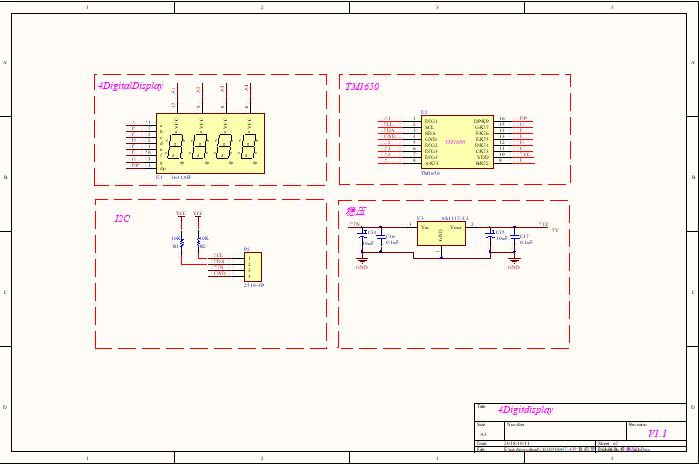

# 4位计时数码管模块说明

## 概述
NOVA的数码管计时模块可以用来显示时间。配套的驱动程序，做了简化设计，方便用户快速上手。

## 参数
- 尺寸：57x24mm
- 工作电压：5V
- 类型：4位8段共阴数码管
- 接口模式：2510-4p
- 引脚定义：1、2-控制端 3-电源 4-地

## 接口说明
- 可用端口： C0、C1、M0、M1、M2、M3

## 使用方式

## 示例代码

[4位计时数码管示例代码 ](http://www.haohaodada.com/show.php?id=946933)

## 原理图

## 尺寸说明

## 常见问题
