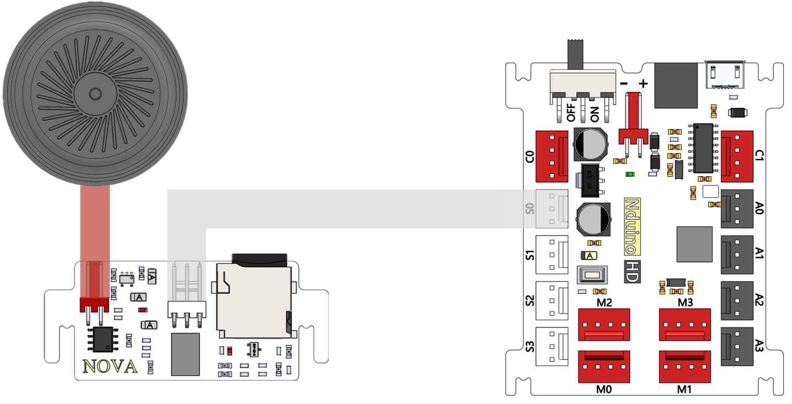
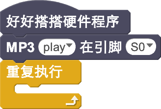
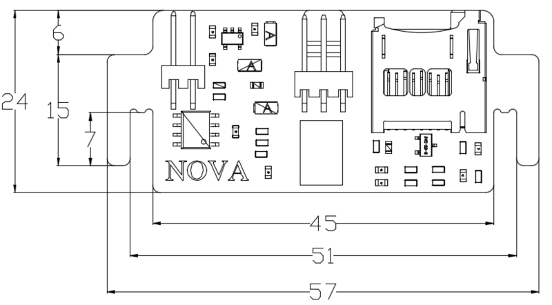

# MP3音乐模块V1.0说明

## 概述
NOVA的MP3模块是一款可以播放歌曲的模块，采用语音芯片YX5200进行解析音乐文件，通过喇叭发出音乐。模块上电之后SD卡下面有一个红色LED灯会亮，当其开始工作后，接线口旁边一个绿灯会闪烁。
SD卡内部mp3文件设置：
SD卡内部新建文件夹，将其命名为mp3。
mp3文件夹内部放置音乐，音乐文件后缀支持.mp3及.wav后缀名。内部放置音乐文件命名必须以0001开头，最多支持65536首曲目。

## 参数
- 尺寸：57x24mm
- 电源要求：+5V
- 类型：模拟模式
- 接口模式：2510-3p
- 引脚定义：1-控制端 2-电源 3-地

## 接口说明
- 可用端口： A0、A1、A2、A3、S0、S1、S2、S3

## 使用方式

## 示例代码

[MP3音乐模块示例代码](http://www.haohaodada.com/show.php?id=947296)

## 原理图
[MP3音乐模块原理图](https://github.com/Haohaodada-official/haohaodada-docs/blob/master/%E5%8E%9F%E7%90%86%E5%9B%BE/MP3%E9%9F%B3%E4%B9%90%E6%A8%A1%E5%9D%97.pdf)

## 尺寸说明

## 常见问题
