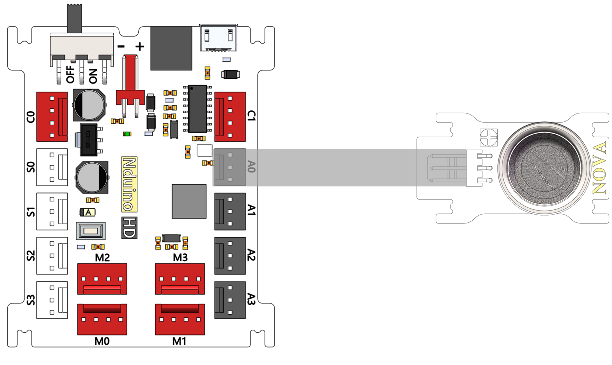
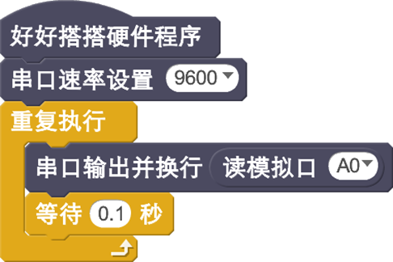
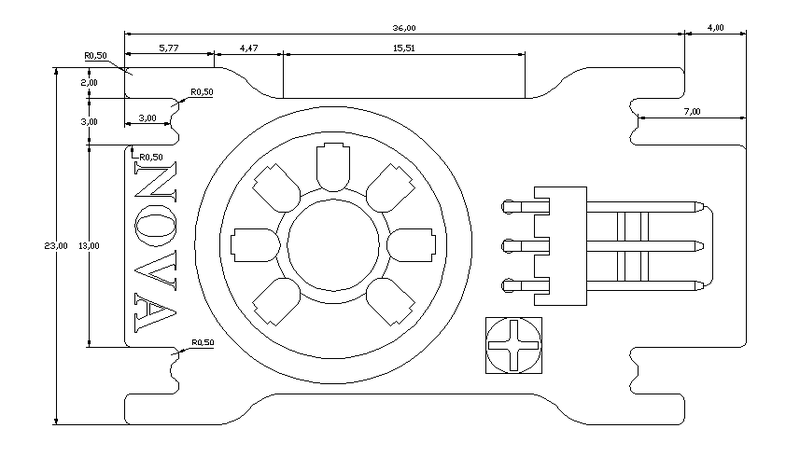

# MQ2传感器模块说明

## 概述
NOVA烟雾传感器MQ-2模块是用于测量空气中的烟雾，其灵敏度高、响应时间快、测量可以尽快，传感器的灵敏度可以调节使用电位计。这个传感器输出电压空气中的烟雾浓度成正比。

## 参数
- 尺寸：40x23mm
- 输入电压：5V
- 工作温度：-10℃-50℃
- 接口模式：2510-3p
- 引脚定义：1-控制端 2-电源 3-地

## 接口说明
- 可用端口： A0、A1、A2、A3、S0、S1、S2、S3

## 使用方式

## 示例代码

[MQ2传感器模块示例代码](http://www.haohaodada.com/show.php?id=947405)

## 原理图

## 尺寸说明

## 常见问题
