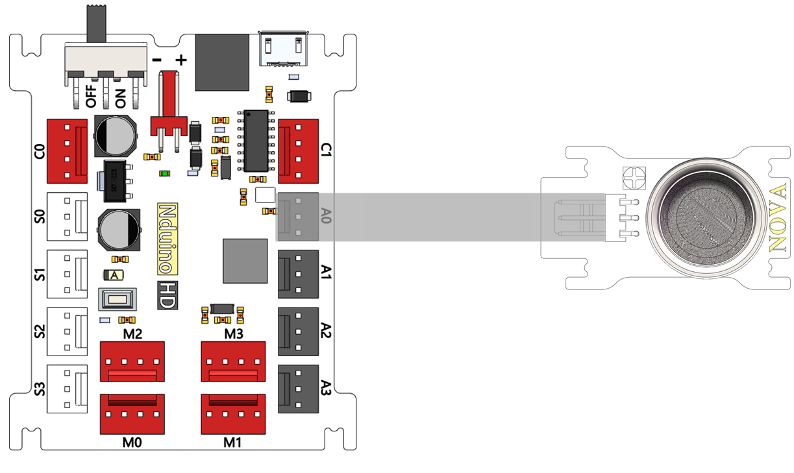

# MQ3传感器模块说明

## 概述
NOVA酒精传感器MQ-3模块是用于酒精泄漏检测，其灵敏度高、响应时间快，传感器的灵敏度可以使用电位计调节。MQ-3传感器输出电压值与空气中的酒精浓度成正比。

## 参数
- 输入电压：5V
- 工作温度：-10℃-50℃

## 接口说明
- 可用端口： A0、A1、A2、A3、S0、S1、S2、S3

## 使用方式

## 示例代码

## 原理图

## 尺寸说明

## 常见问题
