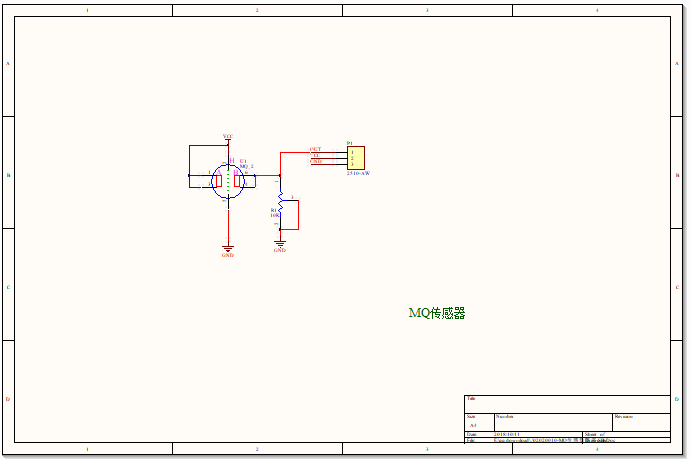
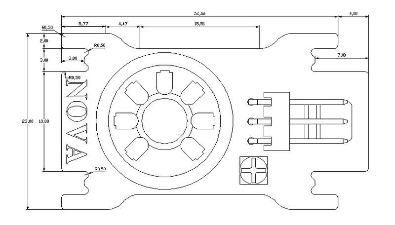

# MQ7传感器模块说明

## 概述
NOVA一氧化碳传感器MQ-7模块是用于一氧化碳气体泄漏检测，其灵敏度高、响应时间快、测量可以尽快。 传感器的灵敏度可以调节使用电位计。

## 参数
- 尺寸：40x23mm
- 输入电压：5V
- 工作温度：-10℃-50℃
- CO检测浓度：20ppm-2000ppm
- 接口模式：2510-3p
- 引脚定义：1-控制端 2-电源 3-地

## 接口说明
- 可用端口： A0、A1、A2、A3、S0、S1、S2、S3

## 使用方式

## 示例代码

[MQ7传感器模块示例代码](http://www.haohaodada.com/show.php?id=947448)

## 原理图

## 尺寸说明

## 常见问题
