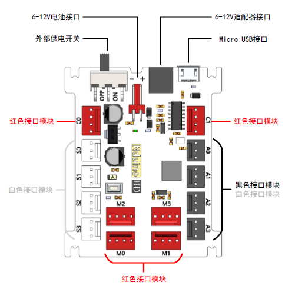

# Nduino HD主板说明

## 概述

Nova是一款专门面向少年儿童创客设计、开发的开源硬件，使用它可以非常方便、快速的造物，制作各种智能装置。

## 特点
- 用颜色重新定义的防反插接口
- 优化电源设计，最大限度保证稳定性
- 卡槽外形设计，适配激光切割结构件

## 参数
- 输入电压：6-12V
- 输出能力：5V 1.5A
- 控制芯片：32位好搭定制ARM芯片 
- 尺寸：66 x 55 x 15 mm(L x W x H)

## 接口说明

1.白色接口模块可以连接Nduino 的白色接口S0-S3，也可以连接主控板的黑色接口A0-A3；

2.黑色接口模块只能连接Nduino 的黑色接口A0-A3。

3.红色接口模块连接Nduino 的红色接口。

## 供电方案
1.Micro USB 连接可以为Nduino 提供5V 电压和最大500mA 电流。

2.由电源适配器（9V1A）或外接电池（电压6V 以上）供电，红色端口的电源VE等于外接电源电压。

## 教程

## 原理图

## 常见问题
