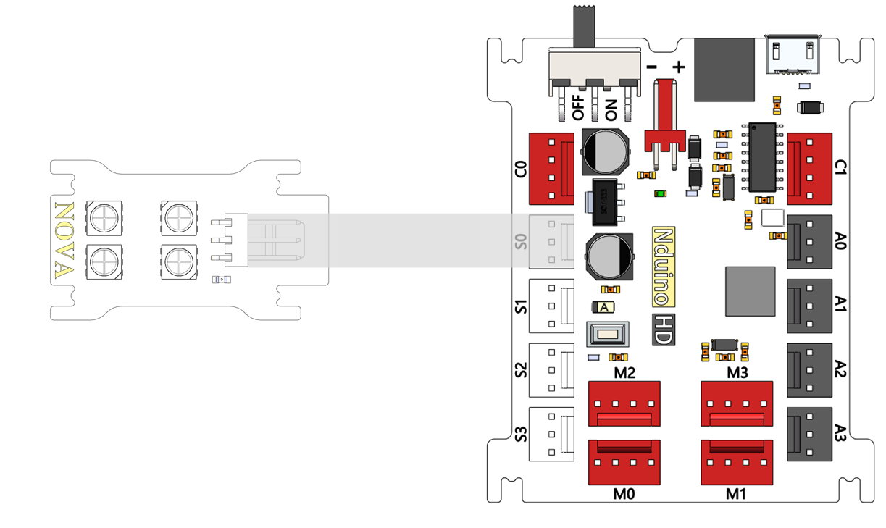
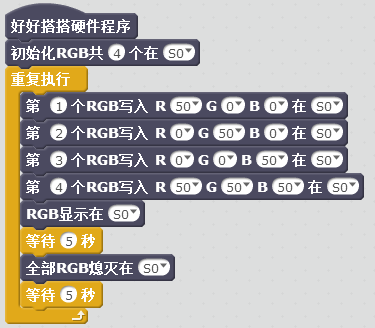
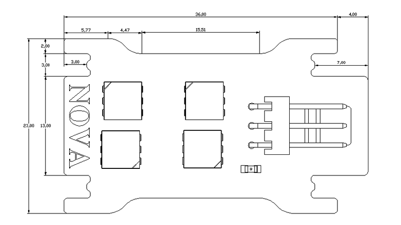

# RGB模块说明

## 概述
Nova的RGB模块主要实现LED灯的各种颜色、亮度的控制，从而产生绚丽的灯光效果。
LED具有低电压驱动，环保节能，亮度高，散射角度大，一致性好，超低功率，超长寿命等优点。将控制电路集成于LED上面，电路变得更加简单，体积小，安装更加简便。

## 参数
- 尺寸：40x23mm
- 电源要求：3.5-5.3V
- 逻辑输入电压：-0.5-VDD+0.5V
- 工作温度-25-80℃
- 振荡频率典型值800KHz
- 接口模式：2510-3p
- 引脚定义：1-信号 2-电源 3-地

## 接口说明
- 可用端口： A0、A1、A2、A3、S0、S1、S2、S3

## 使用方式

## 示例代码

[RGB模块示例代码](http://www.haohaodada.com/show.php?id=947337)

## 原理图
[RGB模块原理图](https://github.com/Haohaodada-official/haohaodada-docs/blob/master/%E5%8E%9F%E7%90%86%E5%9B%BE/RGB%E7%81%AF%E6%A8%A1%E5%9D%97.pdf)

## 尺寸说明

## 常见问题
