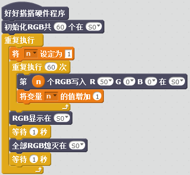

# RGB灯带模块说明

## 概述
Nova的RGB灯带模块为长度一米六的灯带，主要实现60个LED灯的各种颜色、亮度的控制，从而产生绚丽的灯光效果。
LED具有低电压驱动，环保节能，亮度高，散射角度大，一致性好，超低功率，超长寿命等优点。将控制电路集成于LED上面，电路变得更加简单，体积小，安装更加简便。

## 参数
- 尺寸：1.60米
- 电源要求：+5V
- 接口模式：2510-3p
- 引脚定义：1-信号 2-电源 3-地

## 接口说明
- 可用端口： A0、A1、A2、A3、S0、S1、S2、S3

## 使用方式

连接灯带与可用端口

## 示例代码

[RGB灯带模块示例代码](http://www.haohaodada.com/show.php?id=947363)

## 原理图

## 尺寸说明

一米六灯珠

## 常见问题
