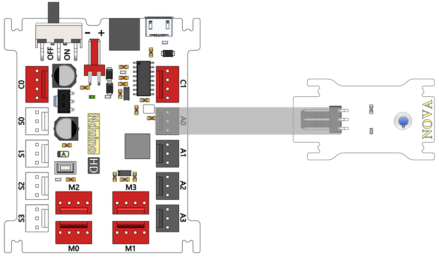

# 亮度传感器模块说明

## 概述
NOVA光敏传感器以模拟量输出，光线越强AD采样值越大，反之越小。

## 参数
- 尺寸：40x23mm
- 检测环境光密度
- 环保光敏二极管
- 模拟输出电压：0~5 VDC
- 适用电源电压：+3~5VDC
- 模拟传感器
- 传感器匹配Arduino扩展板

## 接口说明
- 可用端口： A0、A1、A2、A3

## 使用方式

## 示例代码

## 原理图

## 尺寸说明

## 常见问题
