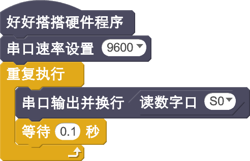

# 倾斜开关模块说明

## 概述
NOVA的倾斜开关SW-200D，一端是金色导针，是导通触发端；另一端是银色导针，是开路端。当外力使倾斜开关里面的滚珠滚到金色一端，则倾斜开关导通，绿色LED状态指示灯灭，输出高电平；滚到银色一端则断开，绿色LED状态指示灯亮，输出低电平。

## 参数
- 输入电压：5V
- 尺寸：40x23mm
- 接口类型：数字
- 引脚定义：1--输出 2--电源 3--地
- 模块接口使用PH2.0插座
- 钢球开关模块角度：2-5度

## 接口说明
- 可用端口： A0、A1、A2、A3、S0、S1、S2、S3

## 使用方式

## 示例代码

## 原理图

## 尺寸说明

## 常见问题
