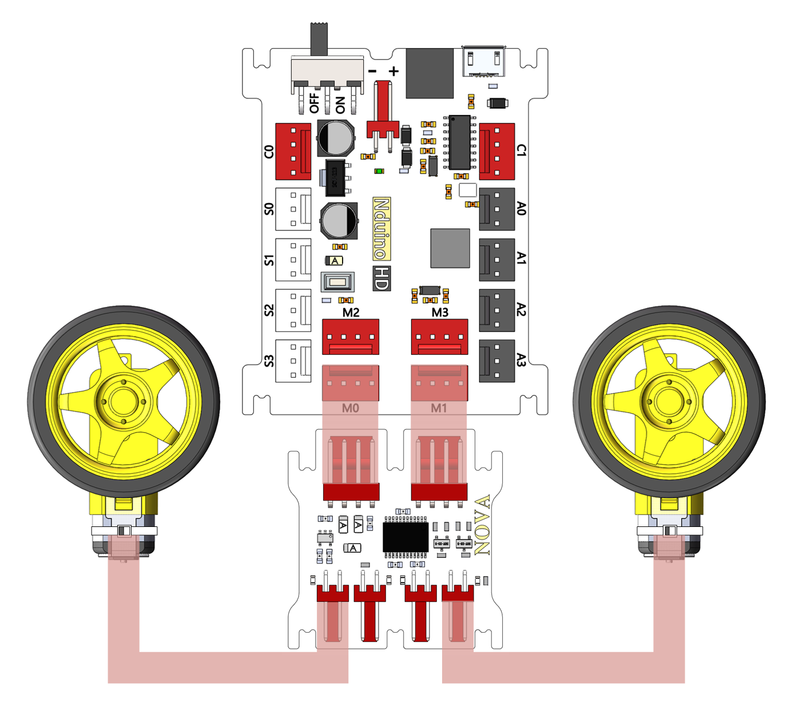
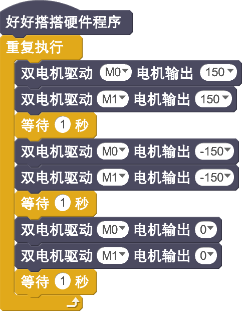

# 双路电机驱动模块说明

## 概述
NOVA的双路电机模块，每个驱动模块可以实现两路电机的同方向控制，支持高低电平控制、PWM调速控制。模块可以连续输出最高1.2A的驱动电流，最大峰值电流为2A，所以模块上在同一路并了两个直流电机，另一路也放了两个电极。同一路的两个电极方向和速度一样。板上有电机正负方向转动指示灯。

## 参数
- 尺寸：40.1x39mm
- TB6612FNG是一款新型直流电机驱动器，它具有集成度高、驱动能力强以及控制方式灵活等特点，具有大电流MOSFET-H桥结构，双通道电路输出，每通道可以连续输出最高1.2A的驱动电流，启动峰值电流可达2A/3.2A，电机控制模式有正转、反转、制动、停止。PWM支持频率高达100KHz。有待机状态，片内低压检测电路与热停机保护电路。

## 接口说明
- 可用端口： M0、M1、M2、M3

## 使用方式

## 示例代码

## 原理图

## 尺寸说明

## 常见问题
