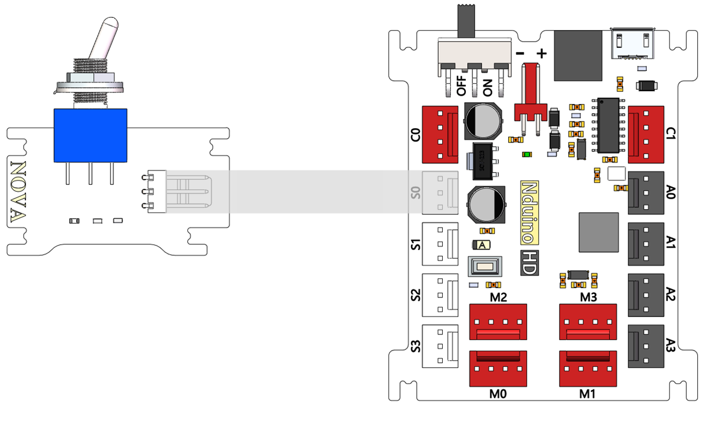
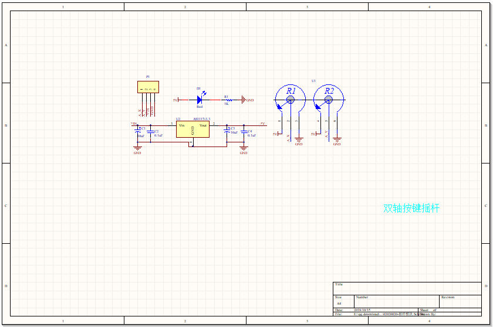
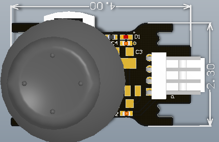

# 扭子开关模块说明

## 概述
Nova的扭子开关模块，可输出一个高低电平，开关没有拨动时是输出高电平，拨动时为输出低电平，从而控制其他的外设等。

## 参数
- 尺寸：57x24mm
- 输入电压：5V
- 接口模式：2510-3p
- 引脚定义：1-控制端 2-电源 3-地

## 接口说明
- 可用端口： A0、A1、A2、A3、S0、S1、S2、S3

## 使用方式

## 示例代码

[扭子开关模块示例代码](http://www.haohaodada.com/show.php?id=947645)

## 原理图

## 尺寸说明

## 常见问题
