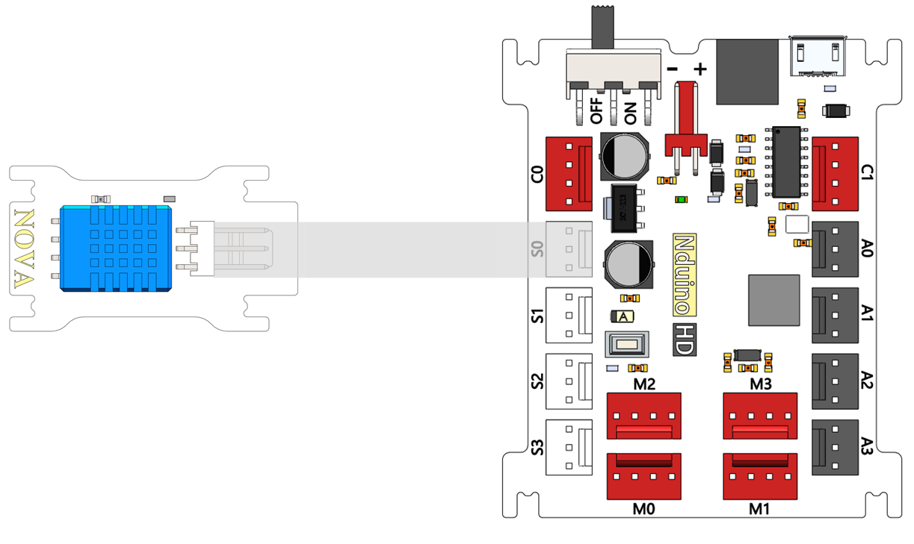
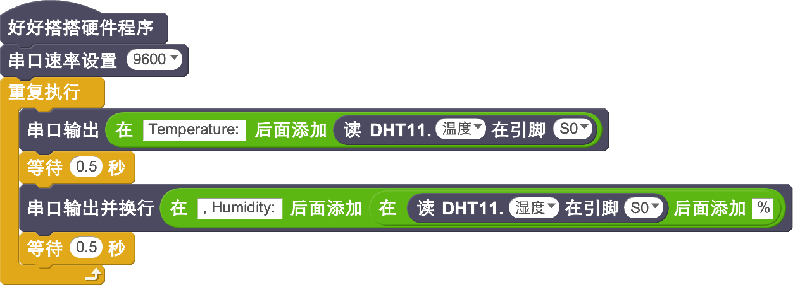

# 温湿度模块说明

## 概述
NOVA温湿度模块采用的是DHT11传感器，可以用来同时测量温度和湿度。

## 参数
- 供电电压：+5V
- 尺寸：40x23mm
- 接口类型：数字
- 温度范围：0-50℃ 误差±2℃
- 湿度范围：20-90%RH 误差±5%RH

## 接口说明
- 可用端口： A0、A1、A2、A3、S0、S1、S2、S3

## 使用方式

## 示例代码

## 原理图

## 尺寸说明

## 常见问题
