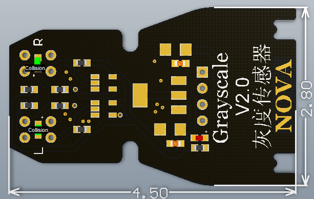

# 灰度传感器模块说明

## 概述
NOVA的灰度模块的灰度传感器采用LTH1550-01，它包括一个红外线发光二极管和盐度，硅光电晶体管并排安装上融合在一个黑色塑料房屋光轴的一面。
还有就是当面对白色平面，灰度传感器与白色平面之间的距离的大小会改变内部硅光电晶体管的导通压降，进而改变比较器的正极输入电压值。 另外通过变阻器调节比较器的负极输入，当正极输入电压大于负极输入电压，比较器输出高电平，灰度模块上的绿色LED转态指示灯灭；当正极输入电压小于负极输入电压，比较器输出低电平，灰度模块上的绿色LED转态指示灯亮；
灰度模块上的正常应该是碰到白色平面亮，碰到黑色平面灭。
正常情况对着白色平面，拉近灰度传感器与白色平面到一定距离，绿色LED指示灯会亮，拉远超出一定距离，绿色LED指示灯会灭。

## 参数
- 尺寸：57x24mm
- 电源要求：+3.3-5V
- 接口模式：2510-4p
- 引脚定义：1、2-控制端 3-电源 4-地

## 接口说明
- 可用端口： C0、C1、M0、M1、M2、M3

## 使用方式

## 示例代码

[灰度传感器模块示例代码](http://www.haohaodada.com/show.php?id=949877)

## 原理图

## 尺寸说明

## 常见问题
