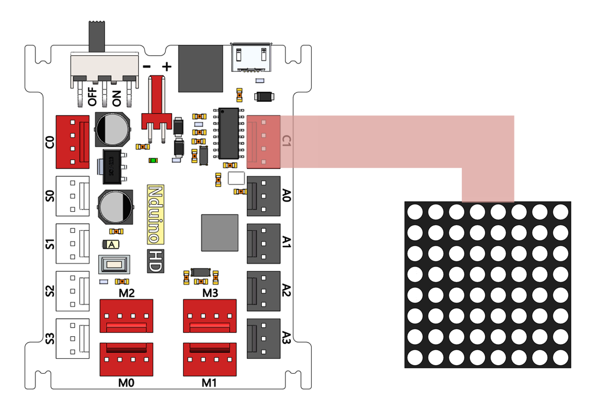
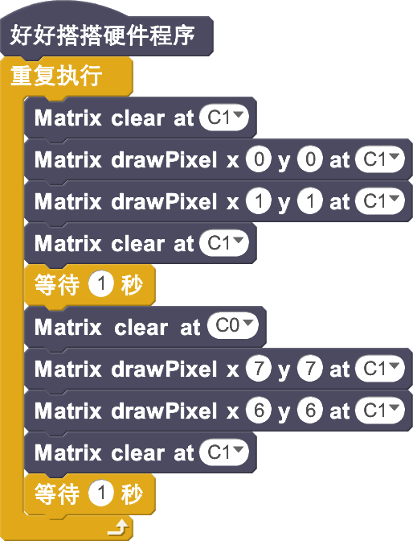
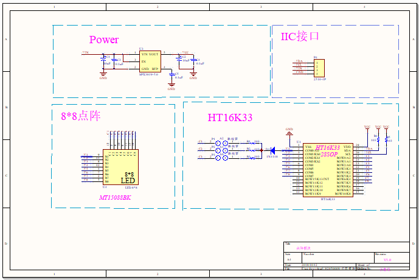
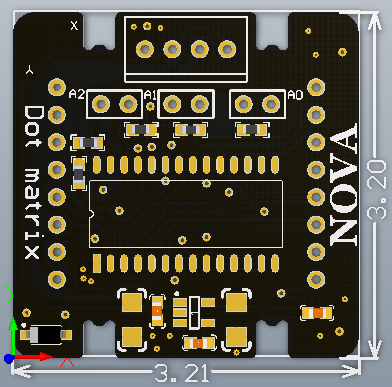

# 点阵模块说明

## 概述
点阵模块采用HT16K33驱动芯片驱动8*8点阵，SPX3819-5.0V电源芯片，I2C接口输入输出数据。HTK16K33芯片集成RC振动器，16*8位RAM可存储显示数据。

## 参数
- 尺寸：57x24mm
- 电源要求：+5V
- 接口模式：2510-4p
- 引脚定义：1、2-控制端 3-电源 4-地

## 接口说明
- 可用端口： C0、C1、M0、M1、M2、M3

## 使用方式

## 示例代码

[点阵模块示例代码](http://www.haohaodada.com/show.php?id=947637)

## 原理图

## 尺寸说明

## 常见问题
