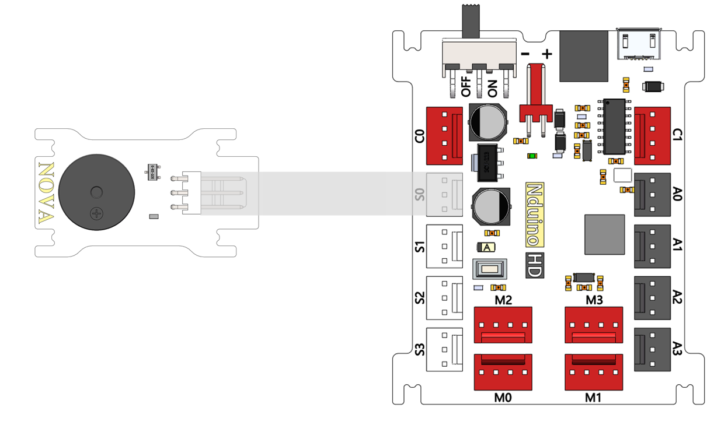

# 蜂鸣器模块说明

## 概述
NOVA的蜂鸣器模块，为无源蜂鸣器，根据输入的频率不同，产生不同的声音。蜂鸣器的工作原理是利用电磁感应现象，为音圈接入交变电流后形成的电磁铁与永磁铁相吸或相斥而推动振膜发声，接入直流电只能持续推动振膜而无法产生声音，只能在接通或断开时产生声音。

## 参数
- 尺寸：40x23mm

## 接口说明
- 可用端口： S0、S1、S2、S3

## 使用方式

## 示例代码

## 原理图

## 尺寸说明

## 常见问题
