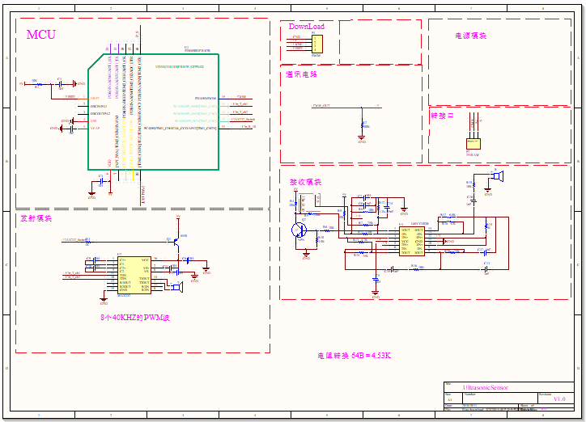
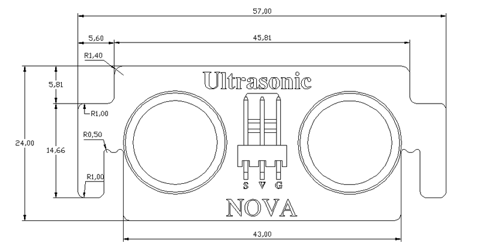
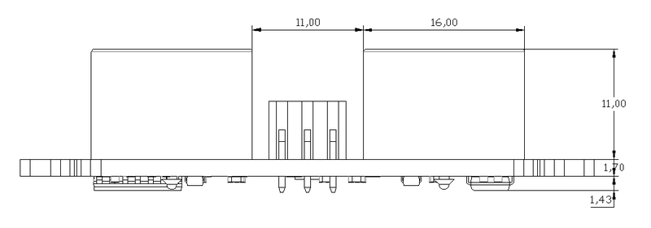

# 超声波传感器模块说明

## 概述
NOVA超声波模块有效探测距离范围为4-400cm，一个发射探头，一个接受探头。

## 参数
- 尺寸：24x57mm
- 电源要求：+3.3-5V
- 类型：数字模式
- 接口模式：2510-3p
- 引脚定义：1-控制端 2-电源 3-地

## 接口说明
- 可用端口： A0、A1、A2、A3、S0、S1、S2、S3

## 使用方式

## 示例代码

[超声波传感器模块示例代码](http://www.haohaodada.com/show.php?id=947506)

## 原理图

## 尺寸说明

## 常见问题
