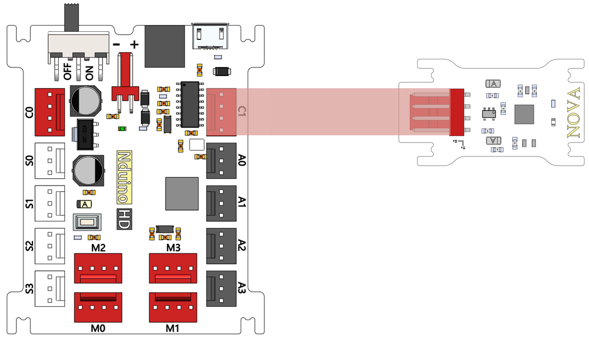
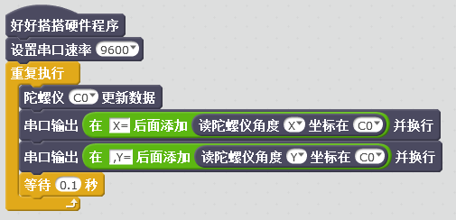

# 陀螺仪模块说明

## 概述
NOVA陀螺仪传感器采用MPU6050芯片，它是一种非常流行的空间运动传感器芯片，可以获取器件当前的三个加速度分量和三个旋转角速度。由于其体积小巧，功能强大，精度较高，不仅被广泛应用于工业，同时也是航模爱好者的神器，被安装在各类飞行器上驰骋蓝天。

## 参数
- 尺寸：40x23mm
- 六轴运动处理组件，三个加速度分量有4个倍率可选：2g、4g、8g、16g。
- 供电电压3.3V，MPU6050芯片内自带一个数据处理子模块DMP，已经内置了卡尔曼滤波算法，在许多应用中使用DMP输出的数据已经能够很好的满足要求。

## 接口说明
- 可用端口： C0、C1、M0、M1、M2、M3

## 使用方式

## 示例代码

## 原理图

## 尺寸说明

## 常见问题
