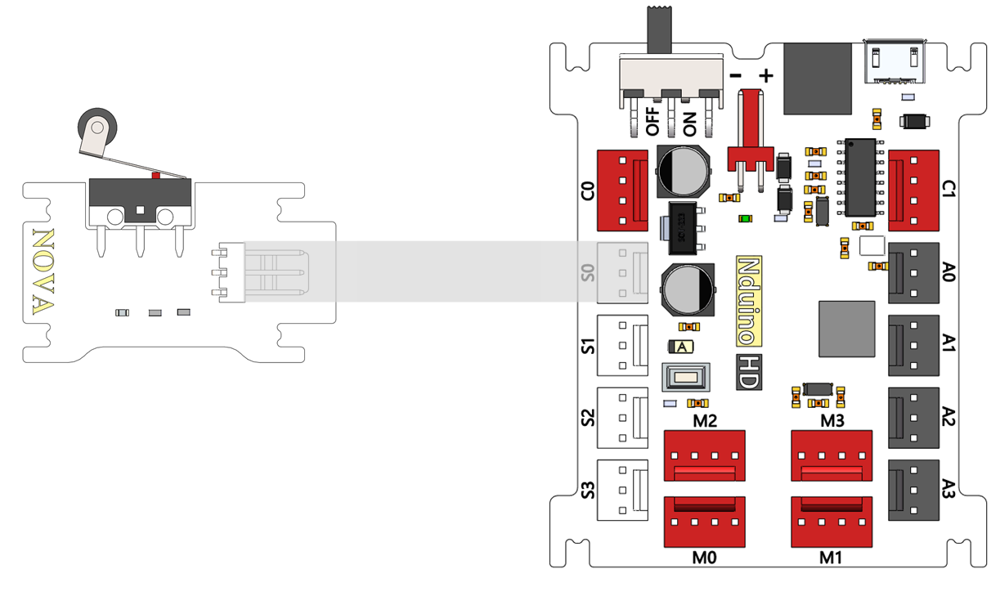

# 陀螺仪模块说明

## 概述
NOVA的限位开关模块，开关没有触碰时输出高电平，绿色LED状态指示灯灭；触碰时输出低电平，绿色LED状态指示灯亮。

## 参数
- 输入电压：5V
- 尺寸：40x23mm
- 限位开关有三个引脚，一个是公共端，一个是常闭脚，另一个是常开脚。没按下时是常闭闭合，常开断开；按下时是常开的闭合，常闭的断开。

## 接口说明
- 可用端口： A0、A1、A2、A3、S0、S1、S2、S3

## 使用方式

## 示例代码

## 原理图

## 尺寸说明

## 常见问题
